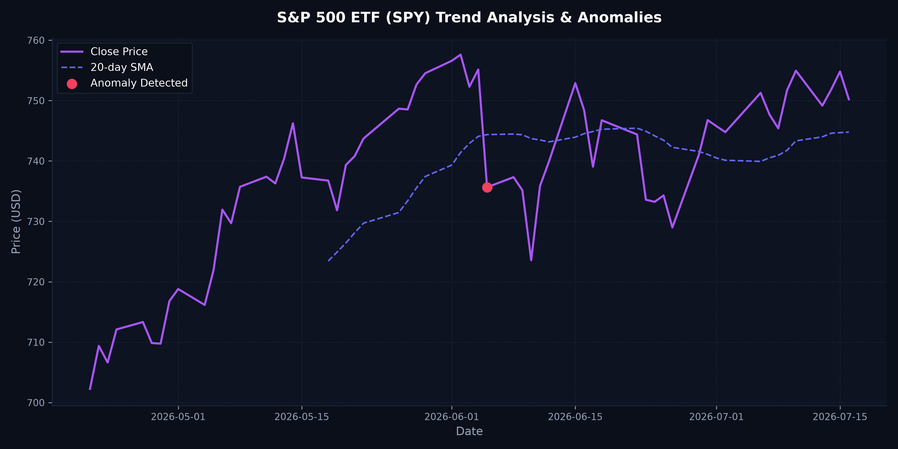

# 📋 Daily Market Anomaly & Trend Report

**Target Asset:** S&P 500 ETF (SPY)
**Execution Date:** 2026-07-16

---

## 📊 Performance Summary
* **Last Closing Price:** $750.22
* **Daily Percent Change:** -0.61%
* **Statistical Anomalies Detected:** 1

---

## 🔍 Visual Analysis
Here is the trend visualization highlighting calculated moving averages and detected statistical outliers (Z-Score > 2.0):



---

## 🚨 Anomaly Event Log
| Date | Closing Price | Daily Return (%) | Outlier Z-Score |
|---|---|---|---|
| 2026-06-05 | $735.65 | -2.58% | 3.17 |

---

## 📝 Generated LinkedIn Draft
Copy and paste this drafted update for your professional portfolio feed:

```markdown
### 💡 Daily Data Science Insights: Market Volatility Audit

🚨 ANOMALY ALERT: A significant price deviation was detected on 2026-06-05 with a return of -2.58% (Z-score: 3.17).

**Key Metrics for S&P 500 ETF (SPY):**
- 📅 Date: 2026-07-16
- 💵 Close Price: $750.22
- 📊 Daily Return: -0.61%
- 🔍 Anomalies in last 45 days: 1

This report was generated automatically by my data engineering and analytics pipeline hosted on GitHub Actions. It runs statistical anomaly detection models (Z-score thresholds) to audit market stability daily.

Check out the full interactive charts and source code on my Git profile!

#DataScience #MachineLearning #Finance #ETL #Automation #GitHubActions
```

---
*Generated by automated daily workflow pipeline at 2026-07-16 18:55:20 UTC*
