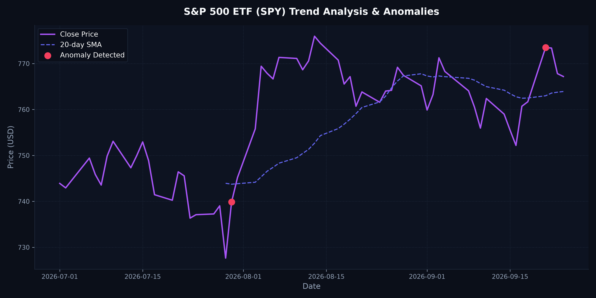

# 📋 Daily Market Anomaly & Trend Report

**Target Asset:** S&P 500 ETF (SPY)
**Execution Date:** 2026-09-24

---

## 📊 Performance Summary
* **Last Closing Price:** $767.18
* **Daily Percent Change:** -0.08%
* **Statistical Anomalies Detected:** 2

---

## 🔍 Visual Analysis
Here is the trend visualization highlighting calculated moving averages and detected statistical outliers (Z-Score > 2.0):



---

## 🚨 Anomaly Event Log
| Date | Closing Price | Daily Return (%) | Outlier Z-Score |
|---|---|---|---|
| 2026-09-21 | $773.50 | +1.55% | 2.22 |
| 2026-07-30 | $739.85 | +1.68% | 2.17 |

---

## 📝 Generated LinkedIn Draft
Copy and paste this drafted update for your professional portfolio feed:

```markdown
### 💡 Daily Data Science Insights: Market Volatility Audit

🚨 ANOMALY ALERT: A significant price deviation was detected on 2026-09-21 with a return of 1.55% (Z-score: 2.22).

**Key Metrics for S&P 500 ETF (SPY):**
- 📅 Date: 2026-09-24
- 💵 Close Price: $767.18
- 📊 Daily Return: -0.08%
- 🔍 Anomalies in last 45 days: 2

This report was generated automatically by my data engineering and analytics pipeline hosted on GitHub Actions. It runs statistical anomaly detection models (Z-score thresholds) to audit market stability daily.

Check out the full interactive charts and source code on my Git profile!

#DataScience #MachineLearning #Finance #ETL #Automation #GitHubActions
```

---
*Generated by automated daily workflow pipeline at 2026-09-24 20:55:21 UTC*
